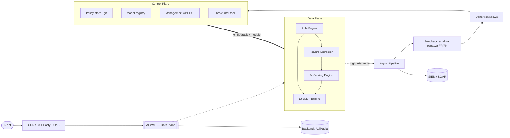
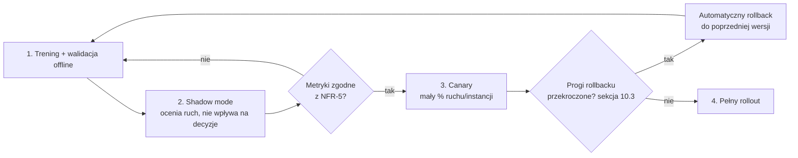
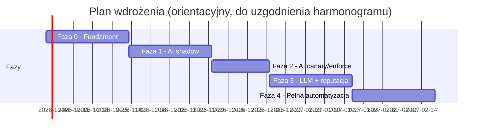

# Specyfikacja: AI-WAF — Web Application Firewall wspomagany AI w czasie rzeczywistym

Wersja: 0.2.0 (draft)
Status: projekt / do konsultacji
Data: 2026-09-23

## 1. Cel i zakres

### 1.1 Cel

Zaprojektowanie systemu WAF (Web Application Firewall), który:

- działa **inline** (na ścieżce żądania HTTP/HTTPS, przed aplikacją),
- wykorzystuje **modele ML/AI** obok klasycznych reguł sygnaturowych do
  wykrywania ataków, w tym ataków nieznanych wcześniej (zero-day, warianty
  znanych technik, ataki wolnowolumenowe rozłożone w czasie),
- podejmuje decyzję **blokuj / przepuść / oznacz i przepuść (monitoring)**
  w czasie rzeczywistym, z budżetem opóźnienia rzędu pojedynczych
  milisekund na żądanie,
- minimalizuje liczbę fałszywych pozytywów (blokowanie legalnego ruchu)
  względem klasycznych WAF opartych wyłącznie na regułach,
- jest audytowalny, konfigurowalny jako kod i integrowalny z istniejącą
  infrastrukturą (reverse proxy, CDN, ingress Kubernetes, SIEM/SOAR).

### 1.2 Zakres

W zakresie:

- ochrona HTTP/HTTPS (REST, GraphQL, WebSocket na etapie handshake) dla
  ruchu warstwy 7,
- wykrywanie klas ataków z OWASP Top 10 / OWASP API Security Top 10:
  SQL Injection, XSS, Command Injection, SSRF, path traversal, insecure
  deserialization, nadużycia autoryzacji na poziomie wzorców ruchu
  (np. BOLA przez anomalie sekwencji zapytań), credential stuffing,
  brute force, scraping/bot traffic, L7 DDoS (żądania wolumenowe
  i wolnowolumenowe),
- silnik reguł statycznych kompatybilny koncepcyjnie z OWASP CRS jako
  warstwa bazowa,
- warstwa detekcji AI: modele anomalii ruchu, klasyfikacja treści żądania,
  opcjonalnie model językowy do analizy kontekstowej podejrzanych
  payloadów,
- panel/API do zarządzania politykami, przeglądu incydentów i strojenia
  progów,
- integracja z logowaniem/SIEM, eksport metryk.

Poza zakresem (jawnie):

- ochrona warstwy 3/4 (wolumetryczne DDoS, SYN flood) — zakładamy, że
  obsługuje to warstwa niższa (CDN/anty-DDoS przed AI-WAF),
  patrz [§13.4](#134-poza-zakresem---uzasadnienie),
- WAF jako produkt komercyjny/SaaS multi-tenant (specyfikacja zakłada
  wdrożenie w ramach jednej organizacji lub jako self-hosted),
- automatyczne "hackback" lub ofensywne działania wobec źródła ataku —
  system wyłącznie broni (blokuje, ogranicza, alarmuje).

### 1.3 Odbiorcy dokumentu

Zespoły: AppSec/Security Engineering, Platform/Infra, SRE, Data/ML,
Compliance. Dokument jest wejściem do implementacji, nie jest samą
implementacją.

## 2. Definicje i skróty

| Skrót | Znaczenie |
|---|---|
| WAF | Web Application Firewall |
| CRS | Core Rule Set (OWASP) |
| FP / FN | False Positive / False Negative |
| p50/p95/p99 | percentyle rozkładu opóźnienia |
| SIEM | Security Information and Event Management |
| SOAR | Security Orchestration, Automation and Response |
| BOLA | Broken Object Level Authorization |
| Fail-open | przy awarii silnika ruch jest przepuszczany |
| Fail-closed | przy awarii silnika ruch jest blokowany |

## 3. Wymagania funkcjonalne

| ID | Wymaganie |
|---|---|
| FR-1 | System analizuje każde żądanie HTTP/HTTPS przechodzące przez punkt inspekcji przed dostarczeniem go do backendu. |
| FR-2 | System klasyfikuje żądanie do jednej z kategorii: `allow`, `block`, `challenge` (np. CAPTCHA/JS-challenge), `monitor` (loguj, nie blokuj). |
| FR-3 | System udostępnia silnik reguł statycznych (sygnatury, wyrażenia regularne, reguły oparte o CRS) niezależny od modelu AI, możliwy do użycia samodzielnie. |
| FR-4 | System udostępnia warstwę AI, która ocenia żądanie/sesję pod kątem anomalii i zwraca wynik ryzyka (score 0–1) oraz uzasadnienie (które cechy/reguły przyczyniły się do wyniku). |
| FR-5 | Decyzja końcowa łączy wynik reguł i wynik AI wg konfigurowalnej polityki (np. `block if rule_hit OR ai_score > threshold`). |
| FR-6 | Progi decyzyjne, reguły i polityki są konfigurowalne bez przebudowy binarki (konfiguracja jako kod, hot-reload). |
| FR-7 | System wspiera tryb "shadow"/"dry-run" dla nowych reguł i modeli — ocena bez wpływu na ruch produkcyjny, z logowaniem hipotetycznej decyzji. |
| FR-8 | System utrzymuje stan sesji/klienta (per IP, per token sesji, per fingerprint) do wykrywania wzorców rozłożonych w czasie (np. wolny brute force, scraping). |
| FR-9 | Każda decyzja blokująca generuje zdarzenie audytowe: znacznik czasu, żądanie (zanonimizowane/zredagowane wg polityki PII), trafione reguły, wynik AI, wersja modelu, decyzja, opóźnienie przetwarzania. |
| FR-10 | System udostępnia API do: zarządzania regułami, zarządzania listami allow/deny (IP, ASN, kraj, user-agent), przeglądu zdarzeń, ręcznego odblokowania/zablokowania klienta. |
| FR-11 | System wspiera whitelisting/exception per endpoint (np. wyłączenie konkretnej reguły dla konkretnej ścieżki, gdy generuje FP). |
| FR-12 | System eksportuje metryki (Prometheus-compatible) i logi (structured JSON, kompatybilne z ECS/OpenTelemetry). |
| FR-13 | System wspiera retraining/aktualizację modeli AI bez przestoju (blue/green modeli), z możliwością rollbacku do poprzedniej wersji. |
| FR-14 | System oznacza źródło ataku metadanymi threat-intel (znane złośliwe IP/ASN, reputacja), jeśli dostępne feedy są skonfigurowane — jako dodatkowa cecha, nie jedyne kryterium. |

## 4. Wymagania niefunkcjonalne

| ID | Kategoria | Wymaganie |
|---|---|---|
| NFR-1 | Wydajność | Dodatkowe opóźnienie wnoszone przez WAF: p50 ≤ 2 ms, p99 ≤ 10 ms na żądanie, przy pełnym łańcuchu reguły+AI. |
| NFR-2 | Przepustowość | Pojedynczy węzeł inspekcji obsługuje ≥ 10 000 req/s przy zachowaniu NFR-1 na referencyjnym sprzęcie (do doprecyzowania w fazie projektowej, patrz §12). |
| NFR-3 | Dostępność | WAF nie może być pojedynczym punktem awarii aplikacji: przy przeciążeniu lub awarii silnika AI system przechodzi w tryb degradacji (tylko reguły statyczne) zamiast całkowitej niedostępności. Domyślnie **fail-open na warstwie AI, fail-closed na warstwie reguł krytycznych** — konfigurowalne per polityka. |
| NFR-4 | Skalowalność | Architektura pozioma skalowalna (stateless data plane, stan sesji w zewnętrznym storze). |
| NFR-5 | Dokładność | Cel: recall ≥ 95% na zestawie testowym znanych klas ataków (OWASP CRS test suite + zbiór własny), przy FP rate ≤ 0.1% na ruchu legalnym referencyjnym. |
| NFR-6 | Bezpieczeństwo systemu | Sam WAF nie wprowadza nowej powierzchni ataku: API zarządzania wymaga uwierzytelnienia (mTLS/OIDC) i autoryzacji RBAC; brak nieuwierzytelnionych endpointów administracyjnych. |
| NFR-7 | Prywatność | Dane żądań przechowywane w logach podlegają redakcji PII/danych wrażliwych wg konfigurowalnej polityki (np. maskowanie nagłówków Authorization, cookies, pól formularzy oznaczonych jako wrażliwe) — patrz §11. |
| NFR-8 | Audytowalność | Każda zmiana reguły/polityki/modelu jest wersjonowana i przypisana do tożsamości (kto, kiedy, co, dlaczego — commit message / change request ID). |
| NFR-9 | Obserwowalność | Metryki: liczba żądań wg decyzji, rozkład opóźnień, drift wyniku AI, wskaźnik reguł trafianych, FP zgłoszone ręcznie. |
| NFR-10 | Przenośność | Data plane wdrażalny jako: sidecar/proxy (np. Envoy filter), moduł reverse proxy (nginx/OpenResty), lub biblioteka do wbudowania w gateway/ingress. |

## 5. Architektura systemu

### 5.1 Widok wysokopoziomowy



Ścieżka krytyczna (linia ciągła): `Klient → CDN → Data Plane → Backend`.
Control plane komunikuje się z data plane wyłącznie asynchronicznie
(dystrybucja polityk i modeli, zbieranie logów) — nigdy synchronicznie
na ścieżce żądania, zgodnie z kontraktem z §5.4.

### 5.2 Data plane vs control plane

- **Data plane** — komponent inline, na krytycznej ścieżce żądania.
  Musi być deterministyczny w czasie wykonania (bez wywołań sieciowych
  synchronicznych do zewnętrznych usług na ścieżce decyzji — model AI
  ładowany lokalnie w procesie/sidecarze, nie wywoływany przez sieć per
  żądanie, żeby nie łamać NFR-1).
- **Control plane** — komponent poza ścieżką żądania: dystrybucja polityk,
  wersji modeli, zbieranie logów/metryk asynchronicznie, UI, retraining.
  Awaria control plane nie może zatrzymać data plane (data plane działa
  na ostatniej znanej dobrej konfiguracji/modelu — "last known good").

### 5.3 Warianty wdrożenia data plane

1. **Sidecar/proxy filter** (np. WASM/Rust filter w Envoy) — najniższe
   opóźnienie, wymaga integracji z istniejącym proxy/service mesh.
2. **Moduł reverse proxy** (np. moduł nginx/OpenResty w Lua/Rust) —
   prostsze wdrożenie w klasycznej infrastrukturze.
3. **Ingress controller plugin** (Kubernetes) — dla środowisk
   kontenerowych, WAF jako część ingressu.
4. **Standalone reverse proxy przed aplikacją** — najprostsze wdrożenie,
   dodatkowy hop sieciowy.

Specyfikacja nie narzuca jednego wariantu — kontrakt między data plane
a control plane (§5.4) musi być spełniony niezależnie od wariantu.

### 5.4 Kontrakt data plane ↔ control plane

- Control plane publikuje **bundle konfiguracji** (reguły + polityki +
  wskazanie wersji modelu) jako niemutowalny, podpisany artefakt
  (integrity check — hash/podpis kryptograficzny weryfikowany przed
  załadowaniem).
- Data plane pobiera bundle asynchronicznie (pull z cache lokalnym lub
  push przez kanał kontrolny), nigdy synchronicznie na ścieżce żądania.
- Rollout nowego bundla: canary na wybranym % ruchu lub wybranych
  instancjach, z automatycznym rollbackiem przy wzroście error rate/FP
  powyżej progu (patrz §10.3).

## 6. Pipeline detekcji

### 6.1 Warstwy

```mermaid
flowchart TD
    Req([Żądanie HTTP]) --> W0[Warstwa 0: filtry brzegowe\nnormalizacja, limity rozmiaru]
    W0 --> W1[Warstwa 1: silnik reguł statycznych\nsygnatury / CRS-like]
    W1 --> W2[Warstwa 2: ekstrakcja cech]
    W2 --> W3a[Model anomalii ruchu]
    W2 --> W3b[Model klasyfikacji treści]
    W2 --> W3c[Bot / fingerprint scoring]
    W1 -- wynik reguł --> W4[Warstwa 4: Decision Engine]
    W3a --> W4
    W3b --> W4
    W3c --> W4
    W4 -->|allow| Allow([Przepuść])
    W4 -->|monitor| Monitor([Przepuść + loguj])
    W4 -->|challenge| Challenge([JS-challenge / CAPTCHA])
    W4 -->|block| Block([Odrzuć 403])

    W4 -. asynchronicznie .-> LLM[Warstwa 3: LLM analiza kontekstowa\noffline / near-real-time]
    LLM -. aktualizuje reputację .-> Rep[(Reputacja sesji/IP\nfeature store online)]
    Rep -. wpływa na próg .-> W4
```



1. **Warstwa 0 — filtry brzegowe (tanie, deterministyczne)**
   Limity rozmiaru żądania, walidacja nagłówków, podstawowa normalizacja
   (URL decode, unicode normalization) — wykonywane zawsze, przed
   czymkolwiek innym, żeby uniemożliwić obejścia przez kodowanie.

2. **Warstwa 1 — silnik reguł statycznych**
   Reguły sygnaturowe (regex/wzorce), koncepcyjnie zgodne z OWASP CRS:
   SQLi, XSS, path traversal, command injection, znane payloady CVE.
   Szybkie (indeksowane, np. Aho-Corasick dla wzorców literalnych),
   deterministyczne, łatwe do audytu. Wynik: lista trafionych reguł +
   ich wagi (anomaly score w stylu CRS, nie tylko boolean).

3. **Warstwa 2 — ekstrakcja cech (feature extraction)**
   Z żądania i z kontekstu sesji/klienta wyliczane są cechy wejściowe
   do modeli AI (lista w §7.2). Wykonywana raz, współdzielona przez
   wszystkie modele w warstwie 3.

4. **Warstwa 3 — AI Scoring Engine**
   - **Model anomalii ruchu** (per sesja/IP/fingerprint): wykrywa
     odchylenia od normalnego wzorca (częstotliwość, sekwencja
     endpointów, rozkład kodów odpowiedzi, timing) — nienadzorowany
     lub semi-nadzorowany (np. autoencoder / isolation forest / model
     sekwencyjny lekki wystarczający do inline).
   - **Model klasyfikacji treści żądania**: klasyfikuje payload
     (parametry, body, nagłówki) jako złośliwy/benigny — nadzorowany,
     trenowany na oznaczonych przykładach ataków i ruchu legalnego.
   - **(Opcjonalnie, tryb offline/near-real-time) Analiza kontekstowa
     LLM**: dla żądań oznaczonych jako "podejrzane, ale niejednoznaczne"
     przez warstwy 1–3, model językowy analizuje payload i kontekst,
     żeby zmniejszyć FP/FN na nietypowych, obfuskowanych payloadach.
     **Nie na krytycznej ścieżce inline** ze względu na opóźnienie LLM —
     działa asynchronicznie i wpływa na decyzje kolejnych żądań z tej
     samej sesji/IP (patrz §6.3) lub zasila tryb `challenge`.

5. **Warstwa 4 — Decision Engine**
   Łączy wyniki warstw 1 i 3 wg polityki (np. ważona suma, reguła
   "block if any critical rule OR ai_score > threshold", z
   uwzględnieniem trybu shadow). Zwraca decyzję + pełne uzasadnienie
   (explainability — patrz §7.4).

### 6.2 Tryby decyzji

| Decyzja | Opis |
|---|---|
| `allow` | żądanie przechodzi bez zmian |
| `monitor` | żądanie przechodzi, zdarzenie logowane z podwyższoną szczegółowością do dalszej analizy |
| `challenge` | żądanie przechodzi warunkowo po weryfikacji (JS challenge / CAPTCHA / rate-limit) — stosowane przy niepewnym wyniku (np. ai_score w strefie szarej) zamiast twardego blocka |
| `block` | żądanie odrzucane (kod 403 lub konfigurowalny), zdarzenie logowane jako incydent |

### 6.3 Sprzężenie zwrotne LLM → decyzje kolejnych żądań

Ponieważ analiza LLM jest zbyt wolna na pojedyncze żądanie inline:
wynik LLM dla żądania X aktualizuje **reputację sesji/IP/fingerprinta**
w sklepie stanu (§5, feature store online), co wpływa na próg decyzyjny
dla **kolejnych** żądań z tego samego źródła w oknie czasowym (np. 15
min). To pozwala wykorzystać głębszą analizę bez wnoszenia jej
opóźnienia na ścieżkę krytyczną (patrz pętla `LLM → Rep → W4` na
diagramie w §6.1).

## 7. Warstwa AI — szczegóły

### 7.1 Cele modeli

| Model | Zadanie | Typ | Latencja budżetowa (inline) |
|---|---|---|---|
| Content classifier | payload → {benign, malicious, klasa ataku} | nadzorowany (gradient boosting / mała sieć neuronowa na cechach, NIE pełny LLM inline) | < 1 ms |
| Traffic anomaly | sekwencja zdarzeń sesji → anomaly score | semi-/nienadzorowany (statystyczny model sekwencyjny lub isolation forest na cechach agregowanych) | < 1 ms (odczyt ze stanu + inkrementalna aktualizacja) |
| Bot/fingerprint scoring | metadane klienta (TLS fingerprint, nagłówki, timing) → prawdopodobieństwo bota | nadzorowany / heurystyczny | < 1 ms |
| Contextual LLM review | payload + kontekst → ocena + uzasadnienie tekstowe | LLM (offline/async) | poza ścieżką inline; SLA np. < 2 s dla wzbogacenia reputacji |

Uwaga projektowa: "AI" w tej specyfikacji nie oznacza wyłącznie LLM.
Modele inline muszą być lekkie (drzewa decyzyjne / gradient boosting /
proste sieci na wektorach cech), żeby spełnić NFR-1. LLM jest
komponentem wzbogacającym poza ścieżką krytyczną, nie rdzeniem detekcji
w czasie rzeczywistym.

### 7.2 Cechy wejściowe (przykładowe, do doprecyzowania w fazie ML)

Per żądanie:
- metoda HTTP, ścieżka (znormalizowana), rozmiar body, typ treści,
- entropia i długość wartości parametrów/pól,
- obecność charakterystycznych tokenów (`UNION SELECT`, `<script>`,
  `../`, sekwencje escape) — jako cechy, nie tylko jako reguły,
- zgodność nagłówków z oczekiwanym schematem (User-Agent, Accept,
  Content-Type) — anomalie sugerujące automatyzację,
- wynik dopasowania reguł statycznych z warstwy 1 (jako cecha wejściowa
  do modelu, nie tylko równoległy sygnał).

Per sesja/klient (agregacje w oknie czasowym, np. 1/5/60 min):
- liczba żądań, liczba unikalnych endpointów, rozkład kodów odpowiedzi
  (np. wysoki odsetek 401/403/404 sugeruje enumerację/brute force),
- czas między żądaniami (rozkład, wariancja — boty mają niską wariancję),
- liczba różnych wartości parametru identyfikującego zasób (sygnał BOLA
  / scraping),
- reputacja IP/ASN z threat-intel (cecha dodatkowa, nie rozstrzygająca
  samodzielnie).

### 7.3 Dane treningowe i etykietowanie

- Źródła: publiczne zbiory (np. CSIC 2010, OWASP CRS test corpus),
  ruch produkcyjny oznaczony przez reguły statyczne o wysokiej
  precyzji (semi-supervised labeling), honeypoty, ręczne oznaczenia
  analityków (feedback loop z §6.3/§10).
- Wymóg: zbalansowanie klas, regularna aktualizacja (ataki ewoluują —
  model bez retrainingu degraduje się, patrz NFR-13/FR-13).
- Segregacja danych: dane treningowe nie mogą zawierać nieredagowanych
  danych wrażliwych klientów (zgodność z §11).

### 7.4 Wyjaśnialność (explainability)

Każdy wynik AI musi zawierać:
- listę top-N cech, które najbardziej wpłynęły na wynik (np. SHAP/wagi
  cech dla modeli drzewiastych),
- powiązane trafione reguły statyczne (jeśli są),
- w przypadku LLM — tekstowe uzasadnienie decyzji.

Wymóg wynika z NFR-8 (audytowalność) i z potrzeby, żeby analityk mógł
szybko ocenić, czy blokada to FP.

### 7.5 Odporność na ataki na sam model (adversarial robustness)

- Model musi być testowany pod kątem znanych technik ewazji WAF:
  obfuskacja (mieszanie wielkości liter, kodowanie wielokrotne,
  komentarze SQL, whitespace tricks, Unicode homoglyphy) — warstwa 0
  (normalizacja) redukuje część tej powierzchni przed dotarciem do
  modelu.
- Trening z uwzględnieniem przykładów adwersarialnych (adversarial
  training) dla znanych klas obejść.
- Rate-limit i monitorowanie prób systematycznego sondowania granic
  modelu (wysoka liczba żądań o rosnącym poziomie obfuskacji z jednego
  źródła — sygnał do podniesienia reputacji ryzyka, §6.3).

## 8. Model danych zdarzeń (event schema)

Minimalny szkielet zdarzenia audytowego/loggingowego (JSON):

```json
{
  "event_id": "uuid",
  "timestamp": "2026-09-23T10:00:00Z",
  "request": {
    "method": "POST",
    "path": "/api/v1/login",
    "client_ip": "203.0.113.10",
    "headers_redacted": { "user-agent": "..." },
    "body_size": 512
  },
  "decision": "block",
  "decision_reason": {
    "rules_matched": ["942100-sqli-union-select"],
    "ai_score": 0.93,
    "ai_top_features": ["param_entropy_high", "session_high_4xx_rate"],
    "model_version": "content-classifier-v3.2.1",
    "policy_version": "policy-2026-09-20-01"
  },
  "latency_ms": 1.8,
  "mode": "enforce"
}
```

Pola `headers_redacted`/`body` podlegają polityce redakcji z §11.

## 9. API i konfiguracja

### 9.1 Zasoby API zarządzania (przykładowy zarys REST)

| Endpoint | Metoda | Opis |
|---|---|---|
| `/api/policies` | GET/POST/PUT | odczyt/tworzenie/aktualizacja polityk decyzyjnych |
| `/api/rules` | GET/POST/PUT/DELETE | zarządzanie regułami statycznymi |
| `/api/rules/{id}/exceptions` | POST | dodanie wyjątku per endpoint (redukcja FP) |
| `/api/models` | GET | lista wersji modeli, status wdrożenia (canary/stable) |
| `/api/models/{id}/rollback` | POST | rollback do poprzedniej wersji modelu |
| `/api/lists/ip` | GET/POST/DELETE | allow/deny listy IP/ASN/CIDR |
| `/api/events` | GET | przegląd zdarzeń z filtrami (czas, decyzja, źródło) |
| `/api/events/{id}/feedback` | POST | oznaczenie zdarzenia jako FP/FN przez analityka (feedback loop) |

Uwierzytelnianie: OIDC (użytkownicy) + mTLS lub podpisane tokeny (service
accounts, np. CI/CD publikujące polityki). Autoryzacja: RBAC z rolami
minimum: `viewer`, `analyst` (feedback, exceptions), `admin` (reguły,
polityki, modele).

### 9.2 Konfiguracja jako kod

- Polityki i reguły przechowywane w repozytorium git (ten sam mechanizm,
  którym zapisujemy tę specyfikację) — każda zmiana to pull request,
  code review, historia zmian (spełnia NFR-8).
  CI waliduje składnię reguł i uruchamia zestaw testów regresyjnych
  (§12) przed merge.
- Control plane synchronizuje stan z gałęzią `main` (lub oznaczonym
  tagiem release) do środowisk zgodnie z pipeline CI/CD.

## 10. Cykl życia modeli AI

### 10.1 Wdrożenie i wersjonowanie

- Każdy model ma unikalną wersję (semver), rejestrowaną w model registry
  z metadanymi: zbiór treningowy (hash/referencja), metryki offline
  (precision/recall/F1 per klasa ataku), data treningu.

### 10.2 Rollout



1. Trening i walidacja offline (§12.2).
2. Wdrożenie w trybie **shadow** — model ocenia ruch produkcyjny,
   decyzje logowane, ale nie wpływają na ruch (FR-7).
3. Porównanie wyników shadow z modelem produkcyjnym i z etykietami
   analityków przez ustalony okres (np. 1–2 tygodnie).
4. **Canary** — model aktywny na małym % ruchu/instancji z automatycznym
   monitoringiem wskaźników (§10.3).
5. Pełny rollout, jeśli wskaźniki w normie.

### 10.3 Automatyczny rollback

Rollback do poprzedniej stabilnej wersji następuje automatycznie, gdy w
oknie obserwacji (np. 15 min) przekroczony zostanie próg:
- wzrost ogólnego error rate aplikacji powyżej baseline o X%,
- wzrost liczby ręcznie zgłoszonych FP powyżej progu,
- wzrost p99 latencji silnika AI powyżej budżetu (NFR-1).

### 10.4 Retraining

- Harmonogram okresowy (np. co tydzień/miesiąc) + wyzwalany zdarzeniowo
  przy wykryciu driftu (zmiana rozkładu cech wejściowych względem
  danych treningowych, monitorowana metryką np. PSI/KL-divergence).
- Dane z feedback loop (§9.1 `/api/events/{id}/feedback`) trafiają do
  zbioru treningowego po weryfikacji jakości etykiet.

## 11. Prywatność i redakcja danych

- Domyślna polityka: nagłówki `Authorization`, `Cookie`, oraz pola
  formularza oznaczone jako wrażliwe (hasła, tokeny, numery kart) są
  **haszowane lub maskowane** przed zapisem do logów/zdarzeń, nigdy
  przechowywane w plaintext.
- Retencja danych zdarzeń: konfigurowalna, domyślnie zgodna z
  wymaganiami compliance organizacji (np. 90 dni dla logów
  szczegółowych, dłużej dla zagregowanych metryk).
- Dane treningowe modeli podlegają tej samej redakcji przed użyciem do
  treningu.
- Zgodność z RODO/GDPR: prawo do usunięcia danych osobowych
  powiązanych z adresem IP/kontem w logach na żądanie, o ile logi
  zawierają dane osobowe (do ustalenia z zespołem Compliance zakres
  faktycznie przechowywanych danych).

## 12. Testowanie i walidacja

### 12.1 Testy funkcjonalne silnika reguł

- Zestaw testów regresyjnych oparty o OWASP CRS test suite (lub
  równoważny) — każda zmiana reguły musi przejść pełny zestaw przed
  merge (§9.2).

### 12.2 Walidacja modeli AI (offline)

- Podział danych train/validation/test z rozdzieleniem czasowym (żeby
  uniknąć wycieku informacji z przyszłości — ataki i ruch legalny
  zmieniają się w czasie).
- Metryki raportowane per klasa ataku: precision, recall, F1, matryca
  pomyłek. Cel zgodny z NFR-5.
- Test odporności na obfuskację (§7.5) jako osobny zestaw testowy.

### 12.3 Testy wydajnościowe

- Testy obciążeniowe (load testing) na referencyjnej konfiguracji
  sprzętowej, potwierdzające NFR-1/NFR-2 przy pełnym łańcuchu
  reguły+AI, pod różnym udziałem ruchu złośliwego (0%, 10%, 50%) —
  ruch złośliwy może zwiększać koszt (więcej trafień reguł, głębsza
  analiza), więc trzeba zmierzyć worst-case.

### 12.4 Testy bezpieczeństwa (red team / pentest)

- Cykliczne testy penetracyjne symulujące próby ominięcia WAF (bypass
  testing): techniki obfuskacji, HTTP request smuggling, fragmentacja
  payloadu między żądaniami, ataki na warstwę AI (adversarial inputs).
- Program bug bounty lub coordinated disclosure dla zewnętrznych
  badaczy, jeśli WAF chroni usługi publiczne.

### 12.5 Testy fałszywych pozytywów

- Zestaw ruchu legalnego reprezentatywnego dla chronionej aplikacji
  (nagrany/syntetyczny), uruchamiany przy każdej zmianie reguł/modelu,
  z twardym progiem FP rate jako warunkiem wdrożenia (bramka w CI/CD).

## 13. Ryzyka i decyzje projektowe

### 13.1 Fail-open vs fail-closed

Domyślna rekomendacja: **fail-closed dla reguł krytycznych o wysokiej
pewności** (np. jawny SQLi w parametrze — blokuj nawet jeśli silnik AI
jest niedostępny), **fail-open dla warstwy AI** (jeśli model/silnik AI
jest niedostępny, poleganie na regułach statycznych zamiast blokowania
całego ruchu) — równoważy dostępność aplikacji i ryzyko przepuszczenia
ataku. Polityka musi być jawnie konfigurowalna per organizacja, bo
akceptowalny kompromis zależy od profilu ryzyka (np. sektor finansowy
może wybrać fail-closed globalnie).

### 13.2 Ryzyko: model AI jako czarna skrzynka

Mitygacja: wymóg explainability (§7.4) i tryb shadow przed każdym
wdrożeniem (§10.2) — żadna decyzja blokująca nie trafia na produkcję
bez wcześniejszej walidacji na ruchu rzeczywistym.

### 13.3 Ryzyko: model driftu i "zatruwania" danych treningowych
(data poisoning przez feedback loop)

Jeśli atakujący może wpływać na dane, które trafiają do retrainingu
(np. generując ruch, który zostanie błędnie oznaczony jako "benign"),
może stopniowo osłabiać model. Mitygacja: feedback od analityków
(`/api/events/{id}/feedback`) wymaga uwierzytelnionej roli `analyst`+,
automatyczne etykietowanie z ruchu produkcyjnego używane tylko jako
sygnał pomocniczy z niższą wagą niż etykiety ręczne/zweryfikowane
źródła, monitoring anomalii w samym procesie treningowym (nagły skok
udziału jednej klasy w nowych danych treningowych wymaga ręcznej
weryfikacji przed użyciem).

### 13.4 Poza zakresem - uzasadnienie

Ochrona L3/L4 przed wolumetrycznym DDoS wymaga innej klasy
infrastruktury (scrubbing centers, anycast) niż WAF L7 opisywany tutaj;
zakładamy, że AI-WAF stoi za takim komponentem, nie zastępuje go.

## 14. Plan wdrożenia (fazy)

| Faza | Zakres | Kryterium wyjścia |
|---|---|---|
| 0 — Fundament | Silnik reguł statycznych (bez AI), data plane w jednym z wariantów z §5.3, logging, metryki podstawowe | Reguły blokują znane ataki testowe (CRS suite) przy FP rate akceptowalnym na ruchu referencyjnym |
| 1 — AI shadow | Wdrożenie modeli w trybie shadow równolegle do reguł, zbieranie danych do walidacji | Model osiąga docelowe metryki (NFR-5) na danych produkcyjnych w trybie shadow przez ustalony okres |
| 2 — AI canary/enforce | Aktywacja modeli na części ruchu, potem pełny rollout | Brak przekroczenia progów rollbacku (§10.3) przez ustalony okres |
| 3 — Kontekstowa analiza LLM + reputacja | Dodanie warstwy LLM offline i sprzężenia zwrotnego do reputacji sesji (§6.3) | Mierzalna redukcja FP/FN na przypadkach granicznych względem fazy 2 |
| 4 — Automatyzacja pełnego cyklu | Automatyczny retraining, automatyczny rollback, dashboard SOC, integracja SOAR | Cykl wykrycie→retrening→wdrożenie działa bez ręcznej interwencji poza zatwierdzeniem |



## 15. Otwarte pytania (do ustalenia z interesariuszami)

1. Jaki jest docelowy wariant wdrożenia data plane (§5.3) — zależny od
   istniejącej infrastruktury (czy jest już Envoy/service mesh, czy
   klasyczny nginx, czy Kubernetes ingress)?
2. Jaki jest budżet na infrastrukturę ML (trening, GPU dla ewentualnego
   fine-tuningu, hosting modeli)?
3. Czy wymagana jest zgodność z konkretną normą (PCI-DSS, ISO 27001,
   RODO w pełnym zakresie) wpływająca na retencję i redakcję danych
   (§11)?
4. Czy warstwa LLM kontekstowa (§6.1 warstwa 3, opcja) ma korzystać z
   modelu hostowanego zewnętrznie (ryzyko wycieku danych żądań do
   trzeciej strony — wymaga redakcji przed wysyłką) czy z modelu
   hostowanego lokalnie?
5. Jaki SLA dostępności obowiązuje chronioną aplikację — wpływa na
   wybór fail-open/fail-closed (§13.1)?

## 16. Historia zmian dokumentu

| Data | Wersja | Zmiana |
|---|---|---|
| 2026-09-23 | 0.1.0 | Pierwsza wersja specyfikacji |
| 2026-09-23 | 0.2.0 | Dodano diagramy (Mermaid): architektura (§5.1), pipeline detekcji (§6.1), rollout modeli (§10.2), harmonogram wdrożenia (§14) |
